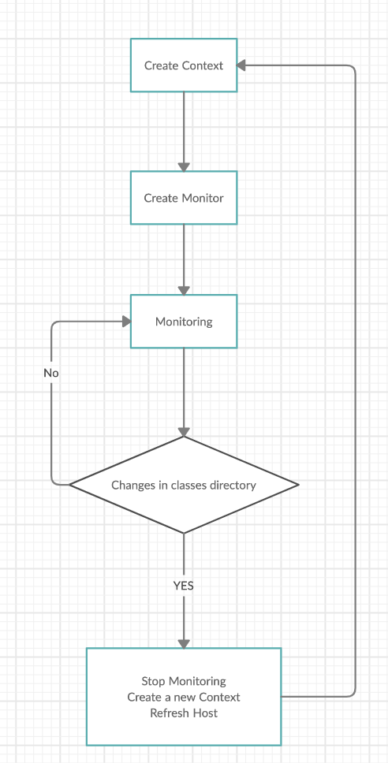

# DIY Servelet Container [Tomcat]
---

> GitHub [@Alex Chen](https://github.com/chen-star) &nbsp;&middot;&nbsp;

---

## Overview

#### What is Tomcat

Simply put, Apache Tomcat is a web server and ***servlet container*** that is used to deploy and serve Java web applications.

#### Then What is Servlet & Web Container

A ***Servelt*** is a class that handles requests, processes them and reply back with a response. 

Servlets are under the control of another Java Application called a ***Servlet Container***. When an application running in a web server receives a request, the server hands the requst to the servlet container - which in turn passes it to the target Servlet. 

~~~
                                                 -----------> Servelt 1
		  request                        |
Client ------------>  Servlet Container-
		                                 |
						 -----------> Servlet 2

~~~

---

## Features

#### Auto Reload 

Simply put, Auto Reload feature in Tomcat is to ask Tomcat monitor classes directory. If any changes being made, automatically reload the context to reflect the change.

**Diagram**

---

#### JSP Processing

**Jsp => .java => .class**

Rely on Tomcat Jasper

##### Filter

~~~xml
    <filter>
        <filter-name>URLFilter</filter-name>
        <filter-class>com.alex.javaweb.URLFilter</filter-class>
    </filter>
    <filter-mapping>
        <filter-name>URLFilter</filter-name>
        <url-pattern>/*</url-pattern>
    </filter-mapping>

~~~

Based on Chain of Responsibility Design Pattern

Before actually handing requests over to corresponding servlets, Tomcat will first loop all configed filters. After went through all filters, the servlet actually cope with the requests.

---

## Tomcat Components

**server.xml structure**

~~~xml
<Server>
    <Connector port="18080"/>
    <Connector port="18081"/>
    <Connector port="18082"/>
    <Service name="Catalina">
        <Engine defaultHost="localhost">
            <Host name="localhost">
                <Context path="/b" docBase="/Users/alexchen/programs/diytomcat/b"/>
            </Host>
        </Engine>
    </Service>
</Server>

~~~

* **Server**
	
	- A Server element represents the entire Catalina servlet container.
	- Therefore, it must be the single outermost element in the conf/server.xml
	- A Server can have ***mulitple*** Service

* **Connector**

	- The HTTP Connector element represents a Connector component that supports the HTTP/1.1 protocol.
	- A server can have ***multiple*** Connector
	
* **Service**
	
	- A Service element represents the combination of one or more Connector components that share a single Engine component for processing incoming requests. 
	- A Server can have ***multiple*** Service
	
* **Engine**

	- The Engine element represents the entire request processing machinery associated with a particular Catalina Service.
	- It receives and processes all requests from one or more Connectors, and returns the completed response to the Connector for ultimate transmission back to the client.
	- A Service can only have ***1*** Engine

* **Host**

	- The Host element represents a virtual host, which is an association of a network name for a server (such as "www.alex.com" with the particular server on which Catalina is running.
	- An Engine can have ***multiple*** Host

	
* **Context**

	- The Context element represents a web application, which is run within a particular virtual host. 
	- Each web application is based on a Web Application Archive (WAR) file, or a corresponding directory containing the corresponding unpacked contents
	- A Host can have ***multiple*** Context

---

## Servlet

* **Default Servlet in Tomcat**

	- InvokerServlet: handle requests to user-defined servlet
	- DefaultServlet: handle static resources
	- JspServlet: handle JSP resources

---

## ClassLoader

* **What is ClassLoader**

	- Load Java class into JVM in runtime
	- .class file ==>  Class Object

* **Parents Delegation Model**

	- Class loaders follow the delegation model where on request to find a class or resource, a ClassLoader instance will delegate the search of the class or resource to the parent class loader.

	- Eg. Let's say we have a request to load an application class into the JVM. The app class loader first delegates the loading of that class to its parent extension class loader which in turn delegates it to the bootstrap class loader. Only if the bootstrap and then the extension class loader is unsuccessful in loading the class, the app class loader tries to load the class itself.
